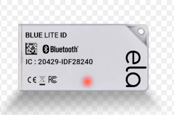

# Émargement — QR & Bluetooth Attendance (Android)

Native Android app for university class attendance ("émargement"). Students sign into class **sessions** and professors open/close sessions and track attendance. Authentication goes through the university **CAS / SSO** (Aix-Marseille Université), and the user's role — professor or student — is derived from the SSO `eduPersonPrimaryAffiliation` attribute, which then drives the entire navigation tree.

Attendance can be validated two independent ways:

- **QR code** — the professor's device displays a session QR code; the student scans it (ML Kit barcode scanning / ZXing).
- **Bluetooth beacon** — the professor's device advertises a BLE beacon; the student's device scans for it in range (AltBeacon), proving physical presence without scanning.

This is a solo academic project (*projet industriel*). It is the Android client of a two-part system; the companion backend (CAS ticket validation + REST API) lives in a separate repository:

> **Backend repository:** _<add link here>_

## Screenshots & hardware

The Bluetooth attendance mechanism relies on a BLE beacon (ELA **Blue Lite ID**): the professor's side advertises it and students' devices detect it in range to confirm physical presence.

<p align="center">
  
</p>

> _App screenshots (login, professor sessions, QR scan, beacon) coming soon — drop image files into `assets/` and embed them here the same way._

## 🎥 Demo videos

| Flow | Video |
|---|---|
| 👨‍🏫 **Professor interface** — open sessions, QR code, attendance | [▶ Watch on Google Drive](https://drive.google.com/file/d/1u10wCjtpb6-pX8k6IG8DfFxWSzDtMMGB/view?usp=sharing) |
| 👨‍🎓 **Student — QR code signing** (with double-sign prevention) | [▶ Watch on Google Drive](https://drive.google.com/file/d/1tzp1UL5rTGHK4edeZBICAS1OXZrjNxrl/view?usp=sharing) |
| 📡 **Student — BLE beacon signing** | [▶ Watch on Google Drive](https://drive.google.com/file/d/1trv81VYxVujE9YiGIRFWvqJbRNzqtAkl/view?usp=sharing) |
| ❌ **Close sessions & disconnect** | [▶ Watch on Google Drive](https://drive.google.com/file/d/1to7r_pcKrI9GKN9Sb7oGwkc1zcwy1VQN/view?usp=sharing) |

## Tech stack

- **Language:** Kotlin
- **UI:** Jetpack Compose + Material 3, Navigation Compose
- **Architecture:** MVVM + Clean Architecture (data / domain / presentation)
- **DI:** Hilt (Dagger)
- **Networking:** Retrofit + Gson
- **Attendance:** ML Kit Barcode Scanning + ZXing (QR), AltBeacon + CameraX (BLE / camera)
- **Auth:** CAS / SSO via WebView interception

## Architecture

The app follows Clean Architecture in three layers, all under `app/src/main/java/com/example/testappqr/`:

- **`data/`** — `datasource/remote/ApiService.kt` (single Retrofit interface), `models/` (DTOs), `repository/` (implementations).
- **`domain/`** — `repository/` interfaces and single-purpose `usecase/` classes (grouped by `login` / `professor` / `student`), each exposing `operator fun invoke(...)`.
- **`presentation/`** — Compose UI grouped by role (`login`, `professor`, `student`, `beacon`), split into `screens/` (route-level), `viewmodels/` (`*VM`, `@HiltViewModel`), and reusable `views/` / `sharedviews/`. `navigation/` holds the nav graph and route definitions.

Network results are wrapped with a small `ApiResult<T>` (`Success` / `Error` / `Loading`) plus a `safeApiCall { }` helper and `.handle(onSuccess, onError, onLoading)` for consumption in ViewModels.

## Prerequisites

- JDK 11
- Android SDK 34 (API level 34)
- Android Studio (Hedgehog or later) or the command-line tools (`sdkmanager`, `avdmanager`)
- A connected Android device or emulator running **API 28+**
- (For QR + beacon features) a physical device — the camera and Bluetooth LE are needed for real testing
- The companion **backend** running and reachable on the same network (see _Configuration_)

## Commands

| Task | Command |
|---|---|
| Build (debug APK) | `gradlew.bat assembleDebug` |
| Install on device/emulator | `gradlew.bat installDebug` |
| Run unit tests | `gradlew.bat test` |
| Run instrumented tests | `gradlew.bat connectedAndroidTest` |
| Lint | `gradlew.bat lint` |

On macOS/Linux use `./gradlew` instead of `gradlew.bat`.

Run a single unit test:

```bash
gradlew.bat test --tests "com.example.testappqr.ExampleUnitTest.addition_isCorrect"
```

## Configuration

The backend address is **not** auto-discovered — it must be set before the app can talk to the server. The app talks to the backend over plain HTTP on a LAN, so cleartext traffic is allowed in `network_security_config.xml`.

Set your backend host (IP and port) in these places:

| File | What to set |
|---|---|
| `app/src/main/java/com/example/testappqr/di/NetworkModule.kt` | Retrofit `baseUrl` (`http://<host>:8080/`) |
| `app/src/main/java/com/example/testappqr/presentation/login/screens/LoginScreen.kt` | `ip`, `amuSSO`, and `validationService` (the CAS callback host) |
| `app/src/main/res/xml/network_security_config.xml` | the cleartext-permitted host, if you restrict it |

> **Demo / offline login:** by default the DI graph (`di/RepositoryModule.kt`) binds `LoginRepository` to `FakeLoginRepositoryImpl`, so the app can run without a live CAS server. Switch the binding to `LoginRepositoryImp` to use the real SSO flow.

## How login works

1. The Login screen loads the AMU CAS page (`https://ident.univ-amu.fr/cas/login`) inside a WebView, passing the backend's validation endpoint as the `service` parameter.
2. After the user authenticates, CAS redirects to the backend's `auth/cas/validate` callback. The app's `WebViewClient.shouldInterceptRequest` catches that URL and hands it to `LoginVM` instead of letting the WebView render it.
3. The backend validates the ticket and returns the user's SSO attributes. Based on `eduPersonPrimaryAffiliation`, the app auto-provisions the user and navigates to either the **professor** or **student** session list.

## Manual smoke test

These checks require the backend running and a device/emulator (camera + Bluetooth needed for the full attendance flow):

1. **Login** — complete CAS sign-in; verify the app routes to the professor or student home depending on the account's role.
2. **Wrong account type** — sign in with an account that is neither student nor teacher; verify the "you must have a teacher or student account" error is shown.
3. **Professor — open session** — open a session and confirm a QR code is displayed.
4. **Student — QR sign** — scan the professor's QR code and confirm the signature is recorded for the session.
5. **Beacon attendance** — with the professor's device advertising, confirm the student's device detects the beacon in range and allows signing.
6. **Permissions** — on first launch, grant location + Bluetooth permissions; verify beacon scanning works and that denying them is handled gracefully.
